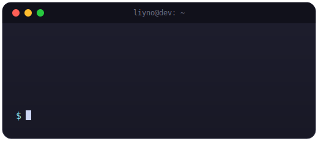
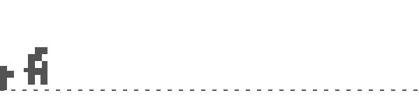
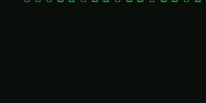

### 🧑‍💻 About Me

- 👨‍💻 AIPM | Workflow Engineer
- 🏢 Digital Tech & Intelligence Center · RPA · AI Agent · Low-Code
- 🎓 Jiangnan University · Digital Media Technology
- 🛠️ Python · Vue · HTML/CSS · JavaScript · RPA · LLM / Prompt Engineering · VibeCoding
- 🌱 Diving deeper into AI applications
- 🎮 ZZZ / Nintendo　🎸 Bass　📷 Photography　🕹️ Gaming　🎌 Anime
- 💬 Unfinished ideas

---

### 🚀 Currently Building

Independently owning 6 enterprise AI systems end-to-end:
Group Chat Intelligence & QA · VOC / Review Management · Competitor Analysis ·
Delivery Photo QA · AIGC Idea Hub · After-sales Auto-Judgment

Behind the scenes: 50+ AI Agents & low-code tables in production, across 15+ departments
e.g. auto delivery tracking & dispatch reminders · 3D elevator/doorway clearance checks · cross-dept sample-making tracker

---

### ⚡ Tech Vibes

---

### 📊 GitHub Stats

  

---

### 💭 Quote of the Day

<!--START_SECTION:quote-->
💬 *"The world is not beautiful, therefore it is."*
— Kino's Journey
<!--END_SECTION:quote-->

